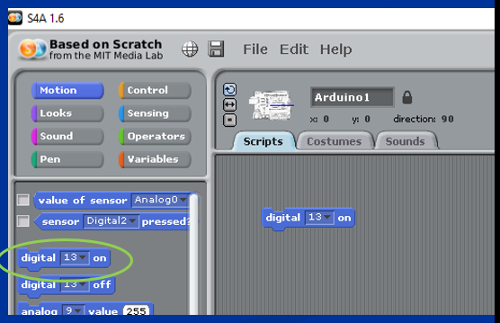
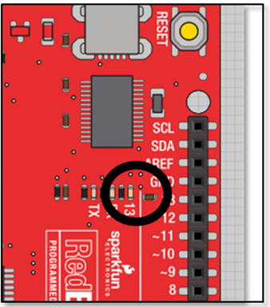
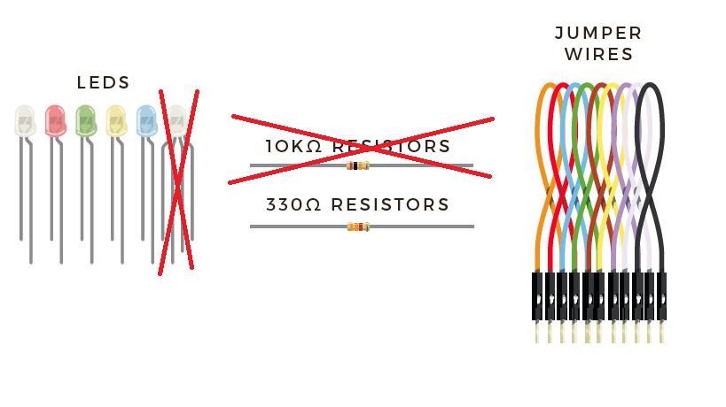
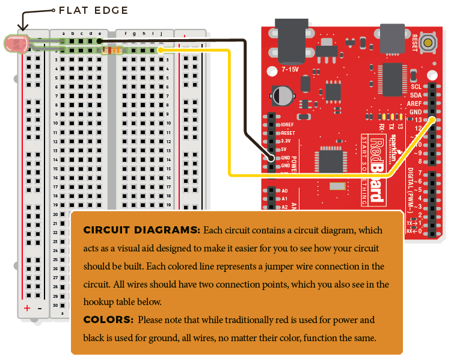
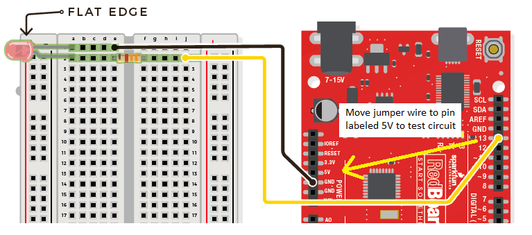
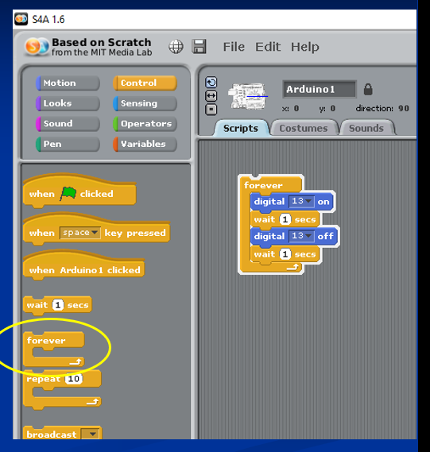

# Use an Arduino to make a LED light blink in the SOS pattern
In this lab you will build a circuit with one LED and one resistor. You will then write a program for the Arduino using Scratch for Arduino to make it blink repeatedly in the [SOS distress signal](https://en.wikipedia.org/wiki/SOS) of three short blinks followed by three long blinks and then three more short blinks.   

### Step 1: Start the Scratch for Arduino program
You can find it by clicking on the Start Menu at the bottom left of the screen and choosing *S4A*. Since the Arduino has not been connected yet, the S4A program should display a "Searching Board" message.

### Step 2: Connect the Arduino with a USB cable
Connect the Arduino to the computer with a USB cable. The "Searching Board" message should disappear. You can test the connection by dragging a *digital 13 on* block to scripts and clicking on it.
   
The built in blue LED near pin 13 (shown below) on the Arduino should light up.    
   
To turn the LED off, drag a *digital 13 off* block to scripts and click on it. 

### Step 3: Build and test the LED circuit
You will need the following parts:
- 1 LED with two wires (called "leads") of any color. (NOT the white LED with 4 leads)
- 1 330Ω ("Ohm") resistor (NOT the 10KΩ resistor, see picture below)
- 2 jumper wires (the color doesn't matter, but you may find it convienant to use the same colors in the wiring diagram below)   

Connect the parts as shown below. Note that the direction of the resistor and jumper wires doesn't matter, but the LED must be connected so that the flat side with the shorter lead is connected to ground (labeled **GND** on the Arduino board). The longer lead of the LED should be connected to the resistor and the resistor should connect to pin 13. 
   
You can test your circuit by moving the jumper wire from pin 13 on the Arduino to the the 5V POWER pin as shown below. If the LED lights up you have built the circuit correctly. If the LED is dimly lit, check to make sure you used the correct resistor. Once you have tested your circuit, move the jumper wire back to pin 13.   
   
### Step 4: Write the Scratch code
To start, drag the following blocks into scripts:
- 1 *digital 13 on* block from the *Motion* tab
- 1 *digital 13 off* block from the *Motion* tab
- 2 *wait 1 secs* blocks from the *Control* tab
- 1 *forever loop* block from the *Control* tab    

Arrange the blocks so that they snap together as shown below. Click on the blocks to start the program      
   
